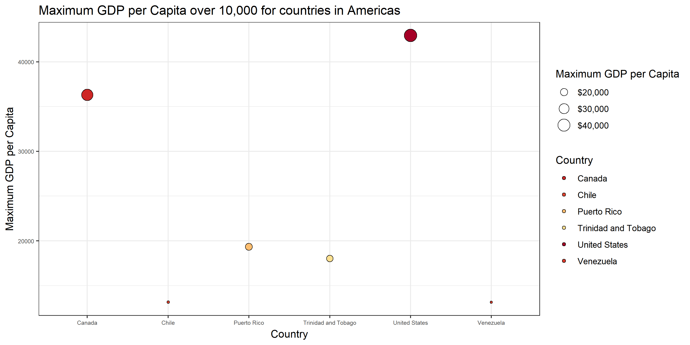

# Bring rectangular data in

```r
## load gapminder
suppressPackageStartupMessages(library(gapminder))
## load tidyverse
suppressPackageStartupMessages(library(tidyverse))
## load forcats
suppressPackageStartupMessages(library(forcats))
## load plotly
suppressPackageStartupMessages(library(plotly))
## load scale
suppressPackageStartupMessages(library(scales))
```

# Part 1: Factor management

## Drop Oceania

Before dropping Oceania, let's check the number of rows in `gapminder`, and the levels of `continent`.


```r
gapminder %>% 
  # get the number of rows and levels of continent
  summarize(
    nrow = nrow(gapminder),
    nlevels = nlevels(gapminder$continent)
  ) %>% 
  # show the table
  knitr::kable(col.names = c("Number of rows", "Levels of `continent`"))
```


 Number of rows   Levels of `continent`
---------------  ----------------------
           1704                       5


Let's first try to drop Oceania, and show the number of rows, and the levels of `continent`.


```r
# drop Oceania
drop <- gapminder %>% 
  filter(continent != "Oceania")

drop %>% 
  # get the number of rows and levels of continent
  summarize(
    nrow = nrow(drop),
    nlevels = nlevels(drop$continent)
  ) %>% 
  # show the table
  knitr::kable(col.names = c("Number of rows after dropping", "Levels of `continent` after dropping"))
```


 Number of rows after dropping   Levels of `continent` after dropping
------------------------------  -------------------------------------
                          1680                                      5

Here we can see, even we remove all rows associated with the `continent` of Oceania (so the number of rows decrease), the levels of `continent` is unchanged. However, it is a wrong value. To fix it, we need to `droplevels()` to solve the issue.


```r
# drop levels
drop_levels <- drop %>% 
  droplevels()

drop_levels %>% 
  # get the number of rows and levels of continent
  summarize(
    nrow = nrow(drop_levels),
    nlevels = nlevels(drop_levels$continent)
  ) %>% 
  # show the table
  knitr::kable(col.names = c("Number of rows after dropping levels", "Levels of `continent` after dropping levels"))
```


 Number of rows after dropping levels   Levels of `continent` after dropping levels
-------------------------------------  --------------------------------------------
                                 1680                                             4

To summarize, we address the number of rows and the levels of `continent` before and after removing Oceania.


```r
# build a tibble with statistics
summary <- cbind(
  before = c(
    nrow(gapminder),
    nlevels(gapminder$continent)
  ),
  after = c(
    nrow(drop_levels),
    nlevels(drop_levels$continent)
  )
)

# assign row names
rownames(summary) <- c("Number of rows", "Levels")

# display the table
summary %>% 
  knitr::kable()
```

                  before   after
---------------  -------  ------
Number of rows      1704    1680
Levels                 5       4

## Reorder the levels of `country` and `continent`

Let's show a preview of our dropped version of `gapminder` before reordering.


```r
# show previews
head(drop_levels) %>% 
  knitr::kable()
```


country       continent    year   lifeExp        pop   gdpPercap
------------  ----------  -----  --------  ---------  ----------
Afghanistan   Asia         1952    28.801    8425333    779.4453
Afghanistan   Asia         1957    30.332    9240934    820.8530
Afghanistan   Asia         1962    31.997   10267083    853.1007
Afghanistan   Asia         1967    34.020   11537966    836.1971
Afghanistan   Asia         1972    36.088   13079460    739.9811
Afghanistan   Asia         1977    38.438   14880372    786.1134

```r
tail(drop_levels) %>% 
  knitr::kable()
```


country    continent    year   lifeExp        pop   gdpPercap
---------  ----------  -----  --------  ---------  ----------
Zimbabwe   Africa       1982    60.363    7636524    788.8550
Zimbabwe   Africa       1987    62.351    9216418    706.1573
Zimbabwe   Africa       1992    60.377   10704340    693.4208
Zimbabwe   Africa       1997    46.809   11404948    792.4500
Zimbabwe   Africa       2002    39.989   11926563    672.0386
Zimbabwe   Africa       2007    43.487   12311143    469.7093

From a bigger picture, this data frame is ordered by the alphabetical order of `country`. Let's try to reorder the levels of `country` by the maximum population over the years using `fct_reorder()`. Note that it is reordered in ascending order, so the first level is the one with least maximum population over the year.


```r
fct_reorder(
  # reorder country
  drop_levels$country,
  # by pop
  drop_levels$pop,
  # using maximum
  max) %>%
  # show preview of resultant levels
  levels() %>% 
  head() %>% 
  knitr::kable(col.names = c("`country` after reordering"))
```


|`country` after reordering |
|:--------------------------|
|Sao Tome and Principe      |
|Iceland                    |
|Djibouti                   |
|Equatorial Guinea          |
|Bahrain                    |
|Comoros                    |

In order to check our results, we manually calculate the maximum population and order it.


```r
drop_levels %>% 
  # group by country
  group_by(country) %>% 
  # calcuate maximum population for each country
  summarize(
    max_pop = max(pop)
  ) %>% 
  # arrange by max_pop
  arrange(max_pop) %>%
  # show preview
  head() %>% 
  knitr::kable(col.names = c("country", "Maximum population over the years"))
```


country                  Maximum population over the years
----------------------  ----------------------------------
Sao Tome and Principe                               199579
Iceland                                             301931
Djibouti                                            496374
Equatorial Guinea                                   551201
Bahrain                                             708573
Comoros                                             710960

So our operation using `fct_reorder` is correct.

We can do the same thing on `continent`. For example, we reorder its levels by the average life expectancy.


```r
fct_reorder(
  # reorder continent
  drop_levels$continent,
  # by lifeExp
  drop_levels$lifeExp,
  # using mean
  mean) %>%
  # show preview of resultant levels
  levels() %>% 
  head() %>% 
  knitr::kable(col.names = c("`continent` after reordering"))
```


|`continent` after reordering |
|:----------------------------|
|Africa                       |
|Asia                         |
|Americas                     |
|Europe                       |

We also double-check the results.


```r
drop_levels %>% 
  # group by continent
  group_by(continent) %>% 
  # calcuate mean lifeExp for each continent
  summarize(
    mean_lifeExp = mean(lifeExp)
  ) %>% 
  # arrange by mean_lifeExp
  arrange(mean_lifeExp) %>%
  # show preview
  head() %>% 
  knitr::kable(col.names = c("continent", "Average life expectancy over the years"))
```


continent    Average life expectancy over the years
----------  ---------------------------------------
Africa                                     48.86533
Asia                                       60.06490
Americas                                   64.65874
Europe                                     71.90369

## Characterize the (derived) data

In the previous section, we try to create two examples using `fct_reorder()` and `arrange()`, with identical results. Now, we try to reuse the first example and see if these two functions affect figures generated.

Let's try the first example, using `fct_reorder()` only.


```r
drop_levels %>%
  # try to only show a continent
  filter(continent == "Americas") %>% 
  # group by country
  group_by(country) %>% 
  # calcuate maximum population for each country
  mutate(
    max_pop = max(pop)
  ) %>%
  # show preview of resultant levels
  ggplot(aes(x = max_pop, y = fct_reorder(country, pop, max), color = country)) +
  # make it a scatterplot
  geom_point() + 
  # scale x axis by log10
  scale_x_log10() +
  # change axis labels
  xlab("Maximum population") +
  ylab("country") +
  # add title
  labs(title = "Maximum population of countries in Americas") +
  # change theme
  theme_bw()
```

<!-- -->

Let's do it with `arrange()` only.


```r
drop_levels %>% 
  # try to only show a continent
  filter(continent == "Americas") %>% 
  # group by country
  group_by(country) %>% 
  # calcuate maximum population for each country
  summarize(
    max_pop = max(pop)
  ) %>% 
  # arrange by max_pop
  arrange(max_pop) %>%
  # show preview of resultant levels
  ggplot(aes(x = max_pop, y = country, color = country)) +
  # make it a scatterplot
  geom_point() + 
  # scale x axis by log10
  scale_x_log10() +
  # change axis labels
  xlab("Maximum population") +
  ylab("country") +
  # add title
  labs(title = "Maximum population of countries in Americas") +
  # change theme
  theme_bw()
```

<!-- -->

Now we use `fct_reorder()` with `arrange()`.


```r
drop_levels %>% 
  # try to only show a continent
  filter(continent == "Americas") %>% 
  # group by country
  group_by(country) %>% 
  # calcuate maximum population for each country
  mutate(
    max_pop = max(pop)
  ) %>% 
  # arrange by max_pop
  arrange(max_pop) %>%
  # show preview of resultant levels
  ggplot(aes(x = max_pop, y = fct_reorder(country, pop, max), color = country)) +
  # make it a scatterplot
  geom_point() + 
  # scale x axis by log10
  scale_x_log10() +
  # change axis labels
  xlab("Maximum population") +
  ylab("country") +
  # add title
  labs(title = "Maximum population of countries in Americas") +
  # change theme
  theme_bw()
```

<!-- -->

**Finding(s):** using `fct_reorder()` (no matter with `arrange()` or not) will change the order of levels shown in figures, while using `arrange()` along will not affect the order of levels. 

# Part 2: File I/O

In order to test if mutated data can survire the round trip of writing and then reading back from a file, we first use the first example in Part 1 to mutate `gapminder`.


```r
data <- gapminder %>% 
  # mutate country by maximum population
  mutate(
    country = fct_reorder(country, pop, max)
  ) %>% 
  # group by country
  group_by(country) %>% 
  # calculate maximum population
  summarize(
    max_pop = max(pop)
  )
  
# show summary of the data
data %>% 
  glimpse()
```

```
## Observations: 142
## Variables: 2
## $ country <fct> Sao Tome and Principe, Iceland, Djibouti, Equatorial G...
## $ max_pop <dbl> 199579, 301931, 496374, 551201, 708573, 710960, 720230...
```

```r
# show previews
head(data) %>% 
  knitr::kable()
```


country                  max_pop
----------------------  --------
Sao Tome and Principe     199579
Iceland                   301931
Djibouti                  496374
Equatorial Guinea         551201
Bahrain                   708573
Comoros                   710960

```r
tail(data) %>% 
  knitr::kable()
```


country             max_pop
--------------  -----------
Pakistan          169270617
Brazil            190010647
Indonesia         223547000
United States     301139947
India            1110396331
China            1318683096

## `write_csv()`/`read_csv()`


```r
# write to csv
write_csv(data, "data_csv.csv")
# read from csv
data_csv <- read_csv("data_csv.csv")
```

```
## Parsed with column specification:
## cols(
##   country = col_character(),
##   max_pop = col_double()
## )
```

```r
# show summary of the data
data_csv %>% 
  glimpse()
```

```
## Observations: 142
## Variables: 2
## $ country <chr> "Sao Tome and Principe", "Iceland", "Djibouti", "Equat...
## $ max_pop <dbl> 199579, 301931, 496374, 551201, 708573, 710960, 720230...
```

```r
# show previews
head(data_csv) %>% 
  knitr::kable()
```


country                  max_pop
----------------------  --------
Sao Tome and Principe     199579
Iceland                   301931
Djibouti                  496374
Equatorial Guinea         551201
Bahrain                   708573
Comoros                   710960

```r
tail(data_csv) %>% 
  knitr::kable()
```


country             max_pop
--------------  -----------
Pakistan          169270617
Brazil            190010647
Indonesia         223547000
United States     301139947
India            1110396331
China            1318683096

**Finding(s):** using CSV format, it requires R to parse each column with default formats. Therefore, the class of `country` changes from `<fct>` to `<chr>`. However, the data keeps unchanged.

## `saveRDS()`/`readRDS()`


```r
# save to rds
saveRDS(data, "data_rds.rds")
# read from rds
data_rds <- readRDS("data_rds.rds")

# show summary of the data
data_rds %>% 
  glimpse()
```

```
## Observations: 142
## Variables: 2
## $ country <fct> Sao Tome and Principe, Iceland, Djibouti, Equatorial G...
## $ max_pop <dbl> 199579, 301931, 496374, 551201, 708573, 710960, 720230...
```

```r
# show previews
head(data_rds) %>% 
  knitr::kable()
```


country                  max_pop
----------------------  --------
Sao Tome and Principe     199579
Iceland                   301931
Djibouti                  496374
Equatorial Guinea         551201
Bahrain                   708573
Comoros                   710960

```r
tail(data_rds) %>% 
  knitr::kable()
```


country             max_pop
--------------  -----------
Pakistan          169270617
Brazil            190010647
Indonesia         223547000
United States     301139947
India            1110396331
China            1318683096

**Finding(s):** `saveRDS()` and `readRDS()` can keep both data and classes of each column.

## `dput()`/`dget()`


```r
# put to file
dput(data, "data.txt")
# get from file
data_get <- dget("data.txt")

# show summary of the data
data_get %>% 
  glimpse()
```

```
## Observations: 142
## Variables: 2
## $ country <fct> Sao Tome and Principe, Iceland, Djibouti, Equatorial G...
## $ max_pop <dbl> 199579, 301931, 496374, 551201, 708573, 710960, 720230...
```

```r
# show previews
head(data_get) %>% 
  knitr::kable()
```


country                  max_pop
----------------------  --------
Sao Tome and Principe     199579
Iceland                   301931
Djibouti                  496374
Equatorial Guinea         551201
Bahrain                   708573
Comoros                   710960

```r
tail(data_get) %>% 
  knitr::kable()
```


country             max_pop
--------------  -----------
Pakistan          169270617
Brazil            190010647
Indonesia         223547000
United States     301139947
India            1110396331
China            1318683096

**Finding(s):** `dput()` and `dget()` can also keep both data and classes of each column.

# Part 3: Visualization design

## Task 1

**Remake at least one figure or create a new one, in light of something you learned in the recent class meetings about visualization design and color.**

Here I want to remake an figure I used in the first assignment. It tries to show the trends of population over the years for each continent.


```r
# this is the figure copy from assignment 1, so no fancy operation is done
p_ori <- gapminder %>% 
  # year as x axis and pop as y axis
  ggplot(aes(x = year, y = pop)) +
  # scale y axis by log10
  scale_y_log10() +
  # make it a scatterplot, and add transparancy
  geom_point(alpha = 0.1) +
  # show colors
  aes(color = continent) + 
  # facetting by continent
  facet_wrap(~ continent)
p_ori
```

<!-- -->

We cannot get too much information for this figure. Therefore, we try to tidy up data, and make better presentation (e,g, color, size) to make it more reasonable.


```r
# tidy up data
tidy_up <- gapminder %>% 
  # group by year and continent
  group_by(year, continent) %>%
  # calcuate summaries of pop
  summarize(
    min_pop = min(pop),
    mean_pop = mean(pop),
    max_pop = max(pop)
  ) %>% 
  # gather pop into two columns
  gather(
    key = "pop_attribute",
    value = "pop_val",
    min_pop, mean_pop, max_pop
  )

# make new plot
p_new <- tidy_up %>% 
  # year as x axis and pop as y axis, group by pop_attribute
  ggplot(aes(x = year, y = pop_val, color = pop_attribute, group = pop_attribute)) +
  # scale y axis by log10
  scale_y_log10() +
  # make it a line plot (with points)
  geom_point() +
  geom_line() +
  # facetting by continent
  facet_wrap(~ continent) +
  # modify labels
  ylab("Population distribution") +
  scale_color_discrete("Population distribution") +
  # add title
  labs(
    title = "Population distribution of each continent over the years"
  ) +
  # make a better x axis
  scale_x_continuous(breaks = scales::pretty_breaks(n = 4)) +
  # add theme
  theme_bw() +
  theme(
    strip.background = element_rect(fill = "grey"),
    panel.background = element_rect(fill = "white")
  )
p_new
```

<!-- -->

**Difference(s):** the color in the new figure is not for each continent, but for different distributions of each continent, which makes more sense. In addition, we try to tidy up data into different distribution attributes, so the trends over the years are clearer.

Let's create a new plot. In this new plot, we show maximum GDP per capita of each country in continent Americas. In addition, to make the figure clearer, we only show countries with maximum GDP per capita larger than 12,000.


```r
# tidy up data
tidy_up_gdp <- gapminder %>% 
  # filter only countries in Americas
  filter(continent == "Americas") %>% 
  # group by country
  group_by(country) %>%
  # calcuate summaries of pop
  summarize(
    max_gdp = max(gdpPercap)
  ) %>% 
  # filter maximum GDP per capita that are bigger than 12,000
  filter(max_gdp >= 12000)

# make new plot
p_new_gdp <- tidy_up_gdp %>% 
  # country as x axis and max_gdp as y axis
  ggplot(aes(x = country, y = max_gdp)) +
  # make it a scatterplot, change size as max_gdp, and fill by country
  geom_point(aes(size = max_gdp, fill = country), pch = 21) +
  # change color based on gapminder country color scheme
  scale_fill_manual(values = country_colors) +
  # change format of size
  scale_size_continuous(
    labels = dollar_format()
  ) +
  # add labels
  labs(
    x = "Country",
    y = "Maximum GDP per Capita",
    title = "Maximum GDP per Capita over 10,000 for countries in Americas",
    size = "Maximum GDP per Capita",
    fill = "Country"
  ) +
  # add theme
  theme_bw() +
  theme(
    axis.text = element_text(size = 6)
  )
p_new_gdp
```

<!-- -->

## Task 2

**Make a new graph by converting this visual (or another, if you’d like) to a `plotly` graph.**

`plotly` is an R package for creating interactive web-based graphs. In the following simple example, the differences of using `plotly` are:

- There is a floating toolbar for users to interact with the figure, e.g saving figure, zooming.
- When users hover on each data point, the details of that data point are shown in a floating window.


```r
# convert a ggplot into plotly
ggplotly(p_new_gdp)
```

<!--html_preserve--><div id="htmlwidget-90acb3f577531cefee50" style="width:672px;height:480px;" class="plotly html-widget"></div>
<script type="application/json" data-for="htmlwidget-90acb3f577531cefee50">{"x":{"data":[{"x":[1],"y":[12779.37964],"text":"max_gdp: 12779.38<br />country: Argentina<br />country: Argentina<br />max_gdp: 12779.38","type":"scatter","mode":"markers","marker":{"autocolorscale":false,"color":"rgba(198,32,38,1)","opacity":1,"size":3.77952755905512,"symbol":"circle","line":{"width":1.88976377952756,"color":"rgba(0,0,0,1)"}},"hoveron":"points","name":"Argentina","legendgroup":"Argentina","showlegend":true,"xaxis":"x","yaxis":"y","hoverinfo":"text","frame":null},{"x":[2],"y":[36319.23501],"text":"max_gdp: 36319.24<br />country: Canada<br />country: Canada<br />max_gdp: 36319.24","type":"scatter","mode":"markers","marker":{"autocolorscale":false,"color":"rgba(206,39,38,1)","opacity":1,"size":20.4714131116713,"symbol":"circle","line":{"width":1.88976377952756,"color":"rgba(0,0,0,1)"}},"hoveron":"points","name":"Canada","legendgroup":"Canada","showlegend":true,"xaxis":"x","yaxis":"y","hoverinfo":"text","frame":null},{"x":[3],"y":[13171.63885],"text":"max_gdp: 13171.64<br />country: Chile<br />country: Chile<br />max_gdp: 13171.64","type":"scatter","mode":"markers","marker":{"autocolorscale":false,"color":"rgba(224,68,48,1)","opacity":1,"size":5.93424376417172,"symbol":"circle","line":{"width":1.88976377952756,"color":"rgba(0,0,0,1)"}},"hoveron":"points","name":"Chile","legendgroup":"Chile","showlegend":true,"xaxis":"x","yaxis":"y","hoverinfo":"text","frame":null},{"x":[4],"y":[19328.70901],"text":"max_gdp: 19328.71<br />country: Puerto Rico<br />country: Puerto Rico<br />max_gdp: 19328.71","type":"scatter","mode":"markers","marker":{"autocolorscale":false,"color":"rgba(253,190,112,1)","opacity":1,"size":12.5839712283718,"symbol":"circle","line":{"width":1.88976377952756,"color":"rgba(0,0,0,1)"}},"hoveron":"points","name":"Puerto Rico","legendgroup":"Puerto Rico","showlegend":true,"xaxis":"x","yaxis":"y","hoverinfo":"text","frame":null},{"x":[5],"y":[18008.50924],"text":"max_gdp: 18008.51<br />country: Trinidad and Tobago<br />country: Trinidad and Tobago<br />max_gdp: 18008.51","type":"scatter","mode":"markers","marker":{"autocolorscale":false,"color":"rgba(254,224,144,1)","opacity":1,"size":11.6466916027585,"symbol":"circle","line":{"width":1.88976377952756,"color":"rgba(0,0,0,1)"}},"hoveron":"points","name":"Trinidad and Tobago","legendgroup":"Trinidad and Tobago","showlegend":true,"xaxis":"x","yaxis":"y","hoverinfo":"text","frame":null},{"x":[6],"y":[42951.65309],"text":"max_gdp: 42951.65<br />country: United States<br />country: United States<br />max_gdp: 42951.65","type":"scatter","mode":"markers","marker":{"autocolorscale":false,"color":"rgba(165,0,38,1)","opacity":1,"size":22.6771653543307,"symbol":"circle","line":{"width":1.88976377952756,"color":"rgba(0,0,0,1)"}},"hoveron":"points","name":"United States","legendgroup":"United States","showlegend":true,"xaxis":"x","yaxis":"y","hoverinfo":"text","frame":null},{"x":[7],"y":[13143.95095],"text":"max_gdp: 13143.95<br />country: Venezuela<br />country: Venezuela<br />max_gdp: 13143.95","type":"scatter","mode":"markers","marker":{"autocolorscale":false,"color":"rgba(219,58,43,1)","opacity":1,"size":5.85680616177159,"symbol":"circle","line":{"width":1.88976377952756,"color":"rgba(0,0,0,1)"}},"hoveron":"points","name":"Venezuela","legendgroup":"Venezuela","showlegend":true,"xaxis":"x","yaxis":"y","hoverinfo":"text","frame":null}],"layout":{"margin":{"t":43.7625570776256,"r":7.30593607305936,"b":36.4632627646326,"l":45.4960564549606},"plot_bgcolor":"rgba(255,255,255,1)","paper_bgcolor":"rgba(255,255,255,1)","font":{"color":"rgba(0,0,0,1)","family":"","size":14.6118721461187},"title":"Maximum GDP per Capita over 10,000 for countries in Americas","titlefont":{"color":"rgba(0,0,0,1)","family":"","size":17.5342465753425},"xaxis":{"domain":[0,1],"automargin":true,"type":"linear","autorange":false,"range":[0.4,7.6],"tickmode":"array","ticktext":["Argentina","Canada","Chile","Puerto Rico","Trinidad and Tobago","United States","Venezuela"],"tickvals":[1,2,3,4,5,6,7],"categoryorder":"array","categoryarray":["Argentina","Canada","Chile","Puerto Rico","Trinidad and Tobago","United States","Venezuela"],"nticks":null,"ticks":"outside","tickcolor":"rgba(51,51,51,1)","ticklen":3.65296803652968,"tickwidth":0.66417600664176,"showticklabels":true,"tickfont":{"color":"rgba(77,77,77,1)","family":"","size":7.97011207970112},"tickangle":-0,"showline":false,"linecolor":null,"linewidth":0,"showgrid":true,"gridcolor":"rgba(235,235,235,1)","gridwidth":0.66417600664176,"zeroline":false,"anchor":"y","title":"Country","titlefont":{"color":"rgba(0,0,0,1)","family":"","size":14.6118721461187},"hoverformat":".2f"},"yaxis":{"domain":[0,1],"automargin":true,"type":"linear","autorange":false,"range":[11270.7659675,44460.2667625],"tickmode":"array","ticktext":["20000","30000","40000"],"tickvals":[20000,30000,40000],"categoryorder":"array","categoryarray":["20000","30000","40000"],"nticks":null,"ticks":"outside","tickcolor":"rgba(51,51,51,1)","ticklen":3.65296803652968,"tickwidth":0.66417600664176,"showticklabels":true,"tickfont":{"color":"rgba(77,77,77,1)","family":"","size":7.97011207970112},"tickangle":-0,"showline":false,"linecolor":null,"linewidth":0,"showgrid":true,"gridcolor":"rgba(235,235,235,1)","gridwidth":0.66417600664176,"zeroline":false,"anchor":"x","title":"Maximum GDP per Capita","titlefont":{"color":"rgba(0,0,0,1)","family":"","size":14.6118721461187},"hoverformat":".2f"},"shapes":[{"type":"rect","fillcolor":"transparent","line":{"color":"rgba(51,51,51,1)","width":0.66417600664176,"linetype":"solid"},"yref":"paper","xref":"paper","x0":0,"x1":1,"y0":0,"y1":1}],"showlegend":true,"legend":{"bgcolor":"rgba(255,255,255,1)","bordercolor":"transparent","borderwidth":1.88976377952756,"font":{"color":"rgba(0,0,0,1)","family":"","size":11.689497716895},"y":0.87007874015748},"annotations":[{"text":"Country<br />Maximum GDP per Capita","x":1.02,"y":1,"showarrow":false,"ax":0,"ay":0,"font":{"color":"rgba(0,0,0,1)","family":"","size":14.6118721461187},"xref":"paper","yref":"paper","textangle":-0,"xanchor":"left","yanchor":"bottom","legendTitle":true}],"hovermode":"closest","barmode":"relative"},"config":{"doubleClick":"reset","modeBarButtonsToAdd":[{"name":"Collaborate","icon":{"width":1000,"ascent":500,"descent":-50,"path":"M487 375c7-10 9-23 5-36l-79-259c-3-12-11-23-22-31-11-8-22-12-35-12l-263 0c-15 0-29 5-43 15-13 10-23 23-28 37-5 13-5 25-1 37 0 0 0 3 1 7 1 5 1 8 1 11 0 2 0 4-1 6 0 3-1 5-1 6 1 2 2 4 3 6 1 2 2 4 4 6 2 3 4 5 5 7 5 7 9 16 13 26 4 10 7 19 9 26 0 2 0 5 0 9-1 4-1 6 0 8 0 2 2 5 4 8 3 3 5 5 5 7 4 6 8 15 12 26 4 11 7 19 7 26 1 1 0 4 0 9-1 4-1 7 0 8 1 2 3 5 6 8 4 4 6 6 6 7 4 5 8 13 13 24 4 11 7 20 7 28 1 1 0 4 0 7-1 3-1 6-1 7 0 2 1 4 3 6 1 1 3 4 5 6 2 3 3 5 5 6 1 2 3 5 4 9 2 3 3 7 5 10 1 3 2 6 4 10 2 4 4 7 6 9 2 3 4 5 7 7 3 2 7 3 11 3 3 0 8 0 13-1l0-1c7 2 12 2 14 2l218 0c14 0 25-5 32-16 8-10 10-23 6-37l-79-259c-7-22-13-37-20-43-7-7-19-10-37-10l-248 0c-5 0-9-2-11-5-2-3-2-7 0-12 4-13 18-20 41-20l264 0c5 0 10 2 16 5 5 3 8 6 10 11l85 282c2 5 2 10 2 17 7-3 13-7 17-13z m-304 0c-1-3-1-5 0-7 1-1 3-2 6-2l174 0c2 0 4 1 7 2 2 2 4 4 5 7l6 18c0 3 0 5-1 7-1 1-3 2-6 2l-173 0c-3 0-5-1-8-2-2-2-4-4-4-7z m-24-73c-1-3-1-5 0-7 2-2 3-2 6-2l174 0c2 0 5 0 7 2 3 2 4 4 5 7l6 18c1 2 0 5-1 6-1 2-3 3-5 3l-174 0c-3 0-5-1-7-3-3-1-4-4-5-6z"},"click":"function(gd) { \n        // is this being viewed in RStudio?\n        if (location.search == '?viewer_pane=1') {\n          alert('To learn about plotly for collaboration, visit:\\n https://cpsievert.github.io/plotly_book/plot-ly-for-collaboration.html');\n        } else {\n          window.open('https://cpsievert.github.io/plotly_book/plot-ly-for-collaboration.html', '_blank');\n        }\n      }"}],"cloud":false},"source":"A","attrs":{"41dc39f5143":{"size":{},"fill":{},"x":{},"y":{},"type":"scatter"}},"cur_data":"41dc39f5143","visdat":{"41dc39f5143":["function (y) ","x"]},"highlight":{"on":"plotly_click","persistent":false,"dynamic":false,"selectize":false,"opacityDim":0.2,"selected":{"opacity":1},"debounce":0},"base_url":"https://plot.ly"},"evals":["config.modeBarButtonsToAdd.0.click"],"jsHooks":[]}</script><!--/html_preserve-->

In addition, we can make 3D plot using `plotly`.


```r
gapminder %>% 
  # group by year and continent
  group_by(year, continent) %>%
  # calcuate summaries of pop
  summarize(
    max_pop = max(pop)
  ) %>% 
  # group by continent
  group_by(continent) %>% 
  # make a 3D plot
  plot_ly(
    x = ~year,
    y = ~continent,
    z = ~max_pop,
    type = "scatter3d",
    mode = "markers + lines",
    color = ~continent
  ) %>% 
  # change layout of the 3D plot
  layout(
    scene = list(
      xaxis = list(title = "Year"),
      yaxis = list(title = "Continent"),
      zaxis = list(title = "Maximum Population")
    )
  )
```

<!--html_preserve--><div id="htmlwidget-b7162f1f9452ad129905" style="width:672px;height:480px;" class="plotly html-widget"></div>
<script type="application/json" data-for="htmlwidget-b7162f1f9452ad129905">{"x":{"visdat":{"41dc4dfe48ed":["function () ","plotlyVisDat"]},"cur_data":"41dc4dfe48ed","attrs":{"41dc4dfe48ed":{"x":{},"y":{},"z":{},"mode":"markers + lines","color":{},"alpha_stroke":1,"sizes":[10,100],"spans":[1,20],"type":"scatter3d"}},"layout":{"margin":{"b":40,"l":60,"t":25,"r":10},"scene":{"xaxis":{"title":"Year"},"yaxis":{"title":"Continent"},"zaxis":{"title":"Maximum Population"}},"yaxis":{"type":"category","categoryorder":"array","categoryarray":["Africa","Americas","Asia","Europe","Oceania"]},"hovermode":"closest","showlegend":true},"source":"A","config":{"modeBarButtonsToAdd":[{"name":"Collaborate","icon":{"width":1000,"ascent":500,"descent":-50,"path":"M487 375c7-10 9-23 5-36l-79-259c-3-12-11-23-22-31-11-8-22-12-35-12l-263 0c-15 0-29 5-43 15-13 10-23 23-28 37-5 13-5 25-1 37 0 0 0 3 1 7 1 5 1 8 1 11 0 2 0 4-1 6 0 3-1 5-1 6 1 2 2 4 3 6 1 2 2 4 4 6 2 3 4 5 5 7 5 7 9 16 13 26 4 10 7 19 9 26 0 2 0 5 0 9-1 4-1 6 0 8 0 2 2 5 4 8 3 3 5 5 5 7 4 6 8 15 12 26 4 11 7 19 7 26 1 1 0 4 0 9-1 4-1 7 0 8 1 2 3 5 6 8 4 4 6 6 6 7 4 5 8 13 13 24 4 11 7 20 7 28 1 1 0 4 0 7-1 3-1 6-1 7 0 2 1 4 3 6 1 1 3 4 5 6 2 3 3 5 5 6 1 2 3 5 4 9 2 3 3 7 5 10 1 3 2 6 4 10 2 4 4 7 6 9 2 3 4 5 7 7 3 2 7 3 11 3 3 0 8 0 13-1l0-1c7 2 12 2 14 2l218 0c14 0 25-5 32-16 8-10 10-23 6-37l-79-259c-7-22-13-37-20-43-7-7-19-10-37-10l-248 0c-5 0-9-2-11-5-2-3-2-7 0-12 4-13 18-20 41-20l264 0c5 0 10 2 16 5 5 3 8 6 10 11l85 282c2 5 2 10 2 17 7-3 13-7 17-13z m-304 0c-1-3-1-5 0-7 1-1 3-2 6-2l174 0c2 0 4 1 7 2 2 2 4 4 5 7l6 18c0 3 0 5-1 7-1 1-3 2-6 2l-173 0c-3 0-5-1-8-2-2-2-4-4-4-7z m-24-73c-1-3-1-5 0-7 2-2 3-2 6-2l174 0c2 0 5 0 7 2 3 2 4 4 5 7l6 18c1 2 0 5-1 6-1 2-3 3-5 3l-174 0c-3 0-5-1-7-3-3-1-4-4-5-6z"},"click":"function(gd) { \n        // is this being viewed in RStudio?\n        if (location.search == '?viewer_pane=1') {\n          alert('To learn about plotly for collaboration, visit:\\n https://cpsievert.github.io/plotly_book/plot-ly-for-collaboration.html');\n        } else {\n          window.open('https://cpsievert.github.io/plotly_book/plot-ly-for-collaboration.html', '_blank');\n        }\n      }"}],"cloud":false},"data":[{"x":[1952,1957,1962,1967,1972,1977,1982,1987,1992,1997,2002,2007],"y":["Africa","Africa","Africa","Africa","Africa","Africa","Africa","Africa","Africa","Africa","Africa","Africa"],"z":[33119096,37173340,41871351,47287752,53740085,62209173,73039376,81551520,93364244,106207839,119901274,135031164],"mode":"markers + lines","type":"scatter3d","name":"Africa","marker":{"color":"rgba(102,194,165,1)","line":{"color":"rgba(102,194,165,1)"}},"textfont":{"color":"rgba(102,194,165,1)"},"error_y":{"color":"rgba(102,194,165,1)"},"error_x":{"color":"rgba(102,194,165,1)"},"line":{"color":"rgba(102,194,165,1)"},"frame":null},{"x":[1952,1957,1962,1967,1972,1977,1982,1987,1992,1997,2002,2007],"y":["Americas","Americas","Americas","Americas","Americas","Americas","Americas","Americas","Americas","Americas","Americas","Americas"],"z":[157553000,171984000,186538000,198712000,209896000,220239000,232187835,242803533,256894189,272911760,287675526,301139947],"mode":"markers + lines","type":"scatter3d","name":"Americas","marker":{"color":"rgba(252,141,98,1)","line":{"color":"rgba(252,141,98,1)"}},"textfont":{"color":"rgba(252,141,98,1)"},"error_y":{"color":"rgba(252,141,98,1)"},"error_x":{"color":"rgba(252,141,98,1)"},"line":{"color":"rgba(252,141,98,1)"},"frame":null},{"x":[1952,1957,1962,1967,1972,1977,1982,1987,1992,1997,2002,2007],"y":["Asia","Asia","Asia","Asia","Asia","Asia","Asia","Asia","Asia","Asia","Asia","Asia"],"z":[556263527,637408000,665770000,754550000,862030000,943455000,1000281000,1084035000,1164970000,1230075000,1280400000,1318683096],"mode":"markers + lines","type":"scatter3d","name":"Asia","marker":{"color":"rgba(141,160,203,1)","line":{"color":"rgba(141,160,203,1)"}},"textfont":{"color":"rgba(141,160,203,1)"},"error_y":{"color":"rgba(141,160,203,1)"},"error_x":{"color":"rgba(141,160,203,1)"},"line":{"color":"rgba(141,160,203,1)"},"frame":null},{"x":[1952,1957,1962,1967,1972,1977,1982,1987,1992,1997,2002,2007],"y":["Europe","Europe","Europe","Europe","Europe","Europe","Europe","Europe","Europe","Europe","Europe","Europe"],"z":[69145952,71019069,73739117,76368453,78717088,78160773,78335266,77718298,80597764,82011073,82350671,82400996],"mode":"markers + lines","type":"scatter3d","name":"Europe","marker":{"color":"rgba(231,138,195,1)","line":{"color":"rgba(231,138,195,1)"}},"textfont":{"color":"rgba(231,138,195,1)"},"error_y":{"color":"rgba(231,138,195,1)"},"error_x":{"color":"rgba(231,138,195,1)"},"line":{"color":"rgba(231,138,195,1)"},"frame":null},{"x":[1952,1957,1962,1967,1972,1977,1982,1987,1992,1997,2002,2007],"y":["Oceania","Oceania","Oceania","Oceania","Oceania","Oceania","Oceania","Oceania","Oceania","Oceania","Oceania","Oceania"],"z":[8691212,9712569,10794968,11872264,13177000,14074100,15184200,16257249,17481977,18565243,19546792,20434176],"mode":"markers + lines","type":"scatter3d","name":"Oceania","marker":{"color":"rgba(166,216,84,1)","line":{"color":"rgba(166,216,84,1)"}},"textfont":{"color":"rgba(166,216,84,1)"},"error_y":{"color":"rgba(166,216,84,1)"},"error_x":{"color":"rgba(166,216,84,1)"},"line":{"color":"rgba(166,216,84,1)"},"frame":null}],"highlight":{"on":"plotly_click","persistent":false,"dynamic":false,"selectize":false,"opacityDim":0.2,"selected":{"opacity":1},"debounce":0},"base_url":"https://plot.ly"},"evals":["config.modeBarButtonsToAdd.0.click"],"jsHooks":[]}</script><!--/html_preserve-->

# Part 4: Writing figures to file

## Arguments of `ggsave()`

Let's play around arguments of `ggsave()`. For example, width, height, resolution, and text scale.

### Differenct widths and heights


```r
# default width and height
ggsave("./ggsave/1.png")
```

```
## Saving 7 x 5 in image
```


```r
# arbitrary width and height
ggsave("./ggsave/2.png", width = 10, height = 5)
```



### Different resolutions

Here we try to generate image of two resolutions, one as normal and one very low.


```r
# normal resolution
ggsave("./ggsave/3.png", dpi = 300)
```

```
## Saving 7 x 5 in image
```


```r
# low resolution
ggsave("./ggsave/4.png", dpi = 10)
```

```
## Saving 7 x 5 in image
```


## Various graphics devices


```r
# vector format
ggsave("./ggsave/5.svg", device = "svg")
```

```
## Saving 7 x 5 in image
```


```r
# raster format
ggsave("./ggsave/6.bmp", device = "bmp")
```

```
## Saving 7 x 5 in image
```


The diffience is, vector format images store polygons, so when it is scaled, the polygons are scaled as well, so they always look the same. While for raster format images, pixels are stored, so image becomes blurry when scaled up.

## Explicit provision of the plot object `p`

Without explicit provision of the plot object `p`, `ggsave()` always tries to save the lastest figure (in our case, it is `p_new_gdp`). Therefore, we need to provide the plot object if we want to save other figures, for example, `p_new`.


```r
# save p_ori
ggsave("./ggsave/7.png", plot = p_new)
```

```
## Saving 7 x 5 in image
```


# But I want to do more!

**Make a deeper exploration of the forcats packages.**

According to [this reference](http://r4ds.had.co.nz/factors.html), we try to explore the following functions of forcats packages:

- `fct_relevel()`;
- `fct_reorder2()`;
- `fct_infreq()` and `fct_rev()`;
- `fct_recode()`;
- `fct_collapse()`; and
- `fct_lump()`.

## `fct_relevel()`

We can use `fct_relevel()` to manually reorder levels. For example, we can move Canada to be the first data in this example (which in the figure is the bottom one).


```r
drop_levels %>% 
  # try to only show a continent
  filter(continent == "Americas") %>% 
  # group by country
  group_by(country) %>% 
  # calcuate maximum population for each country
  summarize(
    max_pop = max(pop)
  ) %>% 
  # arrange by max_pop
  arrange(max_pop) %>%
  # show preview of resultant levels
  ggplot(aes(x = max_pop, y = fct_relevel(country, "Canada"), color = country)) +
  # make it a scatterplot
  geom_point() + 
  # scale x axis by log10
  scale_x_log10() +
  # change axis labels
  xlab("Maximum population") +
  ylab("country") +
  # add title
  labs(title = "Maximum population of countries in Americas") +
  # highlight Canada
  scale_y_discrete(labels = c("Canada" = expression(bold(Canada)), parse = TRUE)) +
  # add theme
  theme_bw() +
  theme(
    strip.background = element_rect(fill = "grey"),
    panel.background = element_rect(fill = "white")
  )
```

<!-- -->

## `fct_reorder2()`

We can use `fct_reorder2()` to reorder by two variables. For example, in the following example, we reorder by population first then GDP per capita (though it is not obvious).


```r
gapminder %>% 
  # show only Oceania
  filter(continent == "Oceania") %>% 
  # pop as x axis and gdpPercap as y axis
  ggplot(aes(x = pop, y = gdpPercap, color = fct_reorder2(country, pop, gdpPercap, min))) +
  # make it a line plot
  geom_line() + 
  # change label
  labs(color = "Country") +
  # add title
  labs(
    x = "Population",
    y = "GDP per capita",
    title = "GDP per capita vs population"
  ) +
  # scale x by log10
  scale_x_log10() +
  # add theme
  theme_bw()
```

<!-- -->

## `fct_infreq()` and `fct_rev()`

We use `fct_infreq()` to order levels in increasing frequency and `fct_rev()` to reverse order. They are usually used in bar plots.


```r
gapminder %>% 
  # show only a continent
  filter(continent == "Americas") %>% 
  # filter countreis with gdpPercap larger than 15,000
  filter(gdpPercap >= 15000) %>% 
  # reorder levels of country
  mutate(
    country = country %>% fct_infreq() %>% fct_rev()
  ) %>% 
  # country as x axis
  ggplot(aes(x = country, fill = country)) +
  # make it as a bar plot
  geom_bar() +
  # add title
  labs(
    x = "Country",
    y = "Count",
    title = "Number of years with GDP per capita >= 15,000"
  ) +
  # add theme
  theme_bw()
```

<!-- -->


## `fct_recode()`

`fct_recode()` can be used to manully change the names of levels. For example, we try to change the name of "United States" in the above example.


```r
gapminder %>% 
  # show only a continent
  filter(continent == "Americas") %>% 
  # filter countreis with gdpPercap larger than 15,000
  filter(gdpPercap >= 15000) %>% 
  # reorder levels of country, and change name of "United States"
  mutate(
    country = country %>% fct_infreq() %>% fct_rev() %>% 
      fct_recode(
        "USA" = "United States"
      )
  ) %>% 
  # country as x axis
  ggplot(aes(x = country, fill = country)) +
  # make it as a bar plot
  geom_bar() +
  # add title
  labs(
    x = "Country",
    y = "Count",
    title = "Number of years with GDP per capita >= 15,000"
  ) +
  # add theme
  theme_bw()
```

<!-- -->

## `fct_collapse()`

We can try to use `fct_collapse()` to manually combine levels into groups. For example, we combined "Canada" and "USA" together in the above example.


```r
gapminder %>% 
  # show only a continent
  filter(continent == "Americas") %>% 
  # filter countreis with gdpPercap larger than 15,000
  filter(gdpPercap >= 15000) %>% 
  # reorder levels of country, and change name of "United States", and combine "Canada" and "USA"
  mutate(
    country = country %>% fct_infreq() %>% fct_rev() %>% 
      fct_recode(
        "USA" = "United States"
      ) %>% 
      fct_collapse(
        "North Americas" = c("Canada", "USA")
      )
  ) %>% 
  # country as x axis
  ggplot(aes(x = country, fill = country)) +
  # make it as a bar plot
  geom_bar() +
  # add title
  labs(
    x = "Country",
    y = "Count",
    title = "Number of years with GDP per capita >= 15,000"
  ) +
  # add theme
  theme_bw()
```

<!-- -->

## `fct_lump()`

`fct_lump()` try to automaticaly aggregate groups.


```r
gapminder %>% 
  # show only a continent
  filter(continent == "Americas") %>% 
  # filter countreis with gdpPercap larger than 15,000
  filter(gdpPercap >= 15000) %>% 
  # reorder levels of country, and let forcats lump groups for us
  mutate(
    country = country %>% fct_infreq() %>% fct_rev() %>% fct_lump()
  ) %>% 
  # country as x axis
  ggplot(aes(x = country, fill = country)) +
  # make it as a bar plot
  geom_bar() +
  # add title
  labs(
    x = "Country",
    y = "Count",
    title = "Number of years with GDP per capita >= 15,000"
  ) +
  # add theme
  theme_bw()
```

<!-- -->

# References
- [R for Data Science - Factors](http://r4ds.had.co.nz/factors.html)
